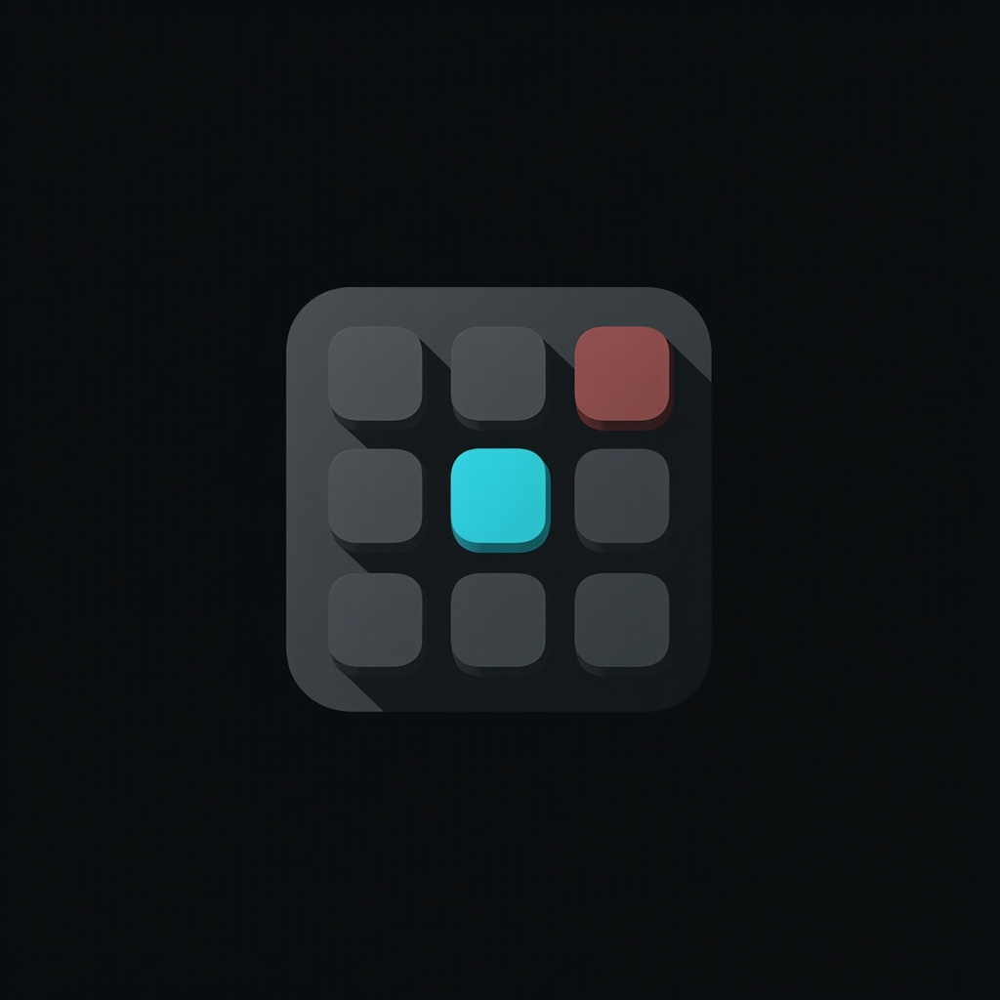

<!-- Improved compatibility of back to top link: See: https://github.com/othneildrew/Best-README-Template/pull/73 -->
<a id="readme-top"></a>
<!--
*** Thanks for checking out the Best-README-Template. If you have a suggestion
*** that would make this better, please fork the repo and create a pull request
*** or simply open an issue with the tag "enhancement".
*** Don't forget to give the project a star!
*** Thanks again! Now go create something AMAZING! :D
-->


<!-- PROJECT SHIELDS -->
<!--
*** I'm using markdown "reference style" links for readability.
*** Reference links are enclosed in brackets [ ] instead of parentheses ( ).
*** See the bottom of this document for the declaration of the reference variables
*** for contributors-url, forks-url, etc. This is an optional, concise syntax you may use.
*** https://www.markdownguide.org/basic-syntax/#reference-style-links
-->
[![Contributors][contributors-shield]][contributors-url]
[![Forks][forks-shield]][forks-url]
[![Stargazers][stars-shield]][stars-url]
[![Issues][issues-shield]][issues-url]
[![MIT License][license-shield]][license-url]
[![CI][ci-shield]][ci-url]


<!-- PROJECT LOGO -->
<br />
<div align="center">
  <a href="https://github.com/tylerdotai/streamdeck-cli">
    
  </a>

<h3 align="center">streamdeck-cli</h3>

  <p align="center">
    A command-line tool for managing Elgato Stream Deck profiles, pages, and actions from your terminal.
    <br />
    <a href="https://github.com/tylerdotai/streamdeck-cli"><strong>Explore the docs »</strong></a>
    <br />
    <br />
    <a href="https://github.com/tylerdotai/streamdeck-cli/issues/new?labels=bug&template=bug-report.md">Report Bug</a>
    &middot;
    <a href="https://github.com/tylerdotai/streamdeck-cli/issues/new?labels=enhancement&template=feature-request.md">Request Feature</a>
  </p>
</div>


<!-- TABLE OF CONTENTS -->
<details>
  <summary>Table of Contents</summary>
  <ol>
    <li>
      <a href="#about-the-project">About The Project</a>
      <ul>
        <li><a href="#built-with">Built With</a></li>
        <li><a href="#reverse-engineering-note">Reverse-Engineering Note</a></li>
      </ul>
    </li>
    <li>
      <a href="#getting-started">Getting Started</a>
      <ul>
        <li><a href="#prerequisites">Prerequisites</a></li>
        <li><a href="#installation">Installation</a></li>
      </ul>
    </li>
    <li><a href="#usage">Usage</a></li>
    <li><a href="#how-it-works">How It Works</a></li>
    <li><a href="#safety">Safety</a></li>
    <li><a href="#roadmap">Roadmap</a></li>
    <li><a href="#contributing">Contributing</a></li>
    <li><a href="#license">License</a></li>
    <li><a href="#contact">Contact</a></li>
    <li><a href="#acknowledgments">Acknowledgments</a></li>
  </ol>
</details>


<!-- ABOUT THE PROJECT -->
## About The Project

The official Elgato Stream Deck app is great for laying out buttons — but the moment you want to **script a page rotation**, **clone a profile for a friend**, **back up before a risky edit**, or **batch-create a page from a template**, you're stuck clicking through the GUI. There is no first-party CLI for managing Stream Deck profiles.

**`streamdeck-cli`** reverse-engineers the on-disk JSON format that the Stream Deck desktop app (tested on **7.3.1**, build 22604) uses, and exposes it as a safe, testable Python CLI. It reads and writes the same files the app does, with atomic-write semantics, case-insensitive UUID handling, and a `validate` command to catch corruption.

Here's why this exists:

* The official **Stream Deck SDK** only supports *building plugins* — there's no first-party tool for managing profiles, pages, or actions you've already laid out.
* Page rotation between streaming modes, focus modes, and "normal work" should be **scriptable**, not clickable.
* A page you spent an hour laying out should be **one zip file** you can email to a friend or stash in git.
* Stream Deck's built-in backup is **opaque**; you can't diff it, version it, or inspect it.

Of course, `streamdeck-cli` doesn't try to replace the GUI — it's a complement for the operations that benefit from being reproducible and scriptable.

<p align="right">(<a href="#readme-top">back to top</a>)</p>


### Built With

* [![Python][python-shield]][python-url] — 3.10 / 3.11 / 3.12 (CI-tested)
* [![Click][click-shield]][click-url] — CLI framework
* [![Rich][rich-shield]][rich-url] — terminal output
* [![PyYAML][yaml-shield]][yaml-url] — page spec parsing
* [![MCP][mcp-shield]][mcp-url] — Model Context Protocol server
* [![Hatchling][hatch-shield]][hatch-url] — build backend
* [![pytest][pytest-shield]][pytest-url] — test runner
* [![Ruff][ruff-shield]][ruff-url] — linter
* [![mypy][mypy-shield]][mypy-url] — type checker
* [![GitHub Actions][gha-shield]][gha-url] — CI

<p align="right">(<a href="#readme-top">back to top</a>)</p>


### Reverse-Engineering Note

`streamdeck-cli` is **not affiliated with Elgato or Corsair**. The on-disk JSON schema is undocumented, and was reverse-engineered by capturing the data files of a real Stream Deck 7.3.1 install on macOS and observing how the app reacts to edits. It is a best-effort description of an undocumented format — please open an issue if you find something we've missed.

See [`docs/schema.md`](docs/schema.md) for the full schema reference, including a worked example of a Hotkey action, the model numbers for every device variant, and the known quirks (case-insensitive UUIDs on macOS, "default" pages can be orphaned, etc.).

<p align="right">(<a href="#readme-top">back to top</a>)</p>


<!-- GETTING STARTED -->
## Getting Started

`streamdeck-cli` runs on **macOS** (tested on 26.5) and **Windows** (path resolution supported; not tested on a live install). Linux is not supported because the Elgato app doesn't ship for it.

> 👉 **For a copy-pasteable first-5-minutes walkthrough against a live install, see [`docs/quickstart.md`](docs/quickstart.md).** Every command in that doc was actually run as part of writing it.

### Prerequisites

* Python **3.10, 3.11, or 3.12** (the CI matrix; 3.14 is not yet verified)
* An installed copy of the **Elgato Stream Deck** desktop app
* A connected Stream Deck device (the CLI can also operate on a backup copy without a device plugged in)

```sh
python3 --version
ls ~/Library/Application\ Support/com.elgato.StreamDeck/
```

### Installation

#### From source (recommended for development)

```sh
git clone https://github.com/tylerdotai/streamdeck-cli
cd streamdeck-cli
python3 -m venv .venv
.venv/bin/pip install -e ".[dev]"
.venv/bin/streamdeck --version
```

#### From a built wheel (when published to PyPI)

```sh
pip install streamdeck-cli
streamdeck --version
```

<p align="right">(<a href="#readme-top">back to top</a>)</p>


<!-- USAGE EXAMPLES -->
## Usage

By default, `streamdeck-cli` reads and writes the standard install root for your platform (`~/Library/Application Support/com.elgato.StreamDeck/` on macOS, `%APPDATA%\Elgato\StreamDeck\` on Windows). Override with `--install-root` for a custom location or a backup you're poking at.

```sh
# Discovery
streamdeck list-devices
streamdeck list-profiles
streamdeck list-pages

# Read
streamdeck show-page <uuid>
streamdeck show-spec <uuid>            # render a page's manifest as YAML

# Write
streamdeck new-page --name "Coding"
streamdeck new-page --from-yaml pages/coding.yaml --icons-dir assets/
streamdeck clone-page <source-uuid> --name "Coding Copy"
streamdeck delete-page <uuid>            # confirmation prompt
streamdeck set-current <uuid>

# Icons
streamdeck set-icon <page-uuid> 0,0 /path/to/icon.png
streamdeck remove-icon <page-uuid> 0,0

# Sharing & version control
streamdeck export -o profile.json
streamdeck export -o profile.yaml
streamdeck import profile.yaml --profile-dir <dir>
streamdeck diff <profile-a-dir> <profile-b-dir>
streamdeck merge <profile-a-dir> <profile-b-dir>            # adds pages, skips mods
streamdeck merge <profile-a-dir> <profile-b-dir> --overwrite --allow-remove

# Validate
streamdeck validate

# Back up / restore
streamdeck backup -o ~/Desktop/profile.zip
streamdeck restore ~/Desktop/profile.zip
```

#### Operate on a custom install root

```sh
streamdeck list-pages --install-root /Volumes/Backup/StreamDeck
streamdeck backup -o bk.zip --install-root /Volumes/Backup/StreamDeck
```

#### Output format

`show-page` prints the full JSON manifest of a page to stdout — useful for piping into `jq`:

```sh
streamdeck show-page ff56cdd9-5ca7-4e39-927d-2390318b62f7 | jq '.Controllers[].Type'
```

`show-spec` is the YAML equivalent — round-trip a page's intent through git:

```sh
streamdeck show-spec ff56cdd9-5ca7-4e39-927d-2390318b62f7 -o pages/coding.yaml
```

For more examples and the full schema, see the [Schema Reference](docs/schema.md).
The schema doc also covers the `streamdeck-cli`-specific extensions:
- **[Appendix A](docs/schema.md#appendix-a-yaml-page-spec-format)** — the
  YAML page spec format used by `new-page --from-yaml` and `show-spec`
- **[Appendix B](docs/schema.md#appendix-b-json--yaml-profile-export-format)**
  — the JSON/YAML profile export format, plus diff and merge semantics

#### Use from an MCP client

The same actions are also exposed as MCP tools (for Claude Code, Cursor, and any other MCP-compatible client) via the `streamdeck-mcp` server. Install the package and add the server to your client's MCP config:

```json
{
  "mcpServers": {
    "streamdeck": {
      "command": "streamdeck-mcp"
    }
  }
}
```

The server speaks stdio JSON-RPC and exposes 18 tools: `list_devices`, `list_profiles`, `list_pages`, `show_page`, `show_spec`, `new_page`, `clone_page`, `delete_page`, `set_current`, `set_icon`, `remove_icon`, `validate`, `backup`, `restore`, `export`, `import_profile`, `diff`, `merge`.

<p align="right">(<a href="#readme-top">back to top</a>)</p>


<!-- HOW IT WORKS -->
## How It Works

**TL;DR:** the Stream Deck desktop app stores everything as JSON in
`~/Library/Application Support/com.elgato.StreamDeck/ProfilesV3/...`. A **profile** is
`<profile-uuid>.sdProfile/manifest.json` plus a `Profiles/` directory of **page** UUIDs.
A **page** is `<page-uuid>/manifest.json` with two `Controllers` (Keypad and Encoder) keyed
by `"col,row"`. `streamdeck-cli` reads and writes these manifests directly, with atomic
write semantics and a zip-based backup format.

```
<root>/
├── ProfilesV3/
│   └── <profile-uuid>.sdProfile/
│       ├── manifest.json
│       └── Profiles/
│           ├── <page-uuid-1>/
│           │   ├── manifest.json
│           │   └── Images/
│           ├── <page-uuid-2>/
│           │   └── ...
│           └── <page-uuid-N>/
│               └── ...
├── BackupV3/   # auto-generated .streamDeckProfilesBackup files (zip)
├── Plugins/    # installed plugins (sdPlugin bundles)
└── Marketplace/# plugin store cache
```

Full schema — every key, every action type, every device model — lives in
[`docs/schema.md`](docs/schema.md).

<p align="right">(<a href="#readme-top">back to top</a>)</p>


<!-- SAFETY -->
## Safety

`streamdeck-cli` is intentionally conservative:

* **Refuses to delete the current or default page.** Switch the current page first
  (`streamdeck set-current <other-uuid>`), then delete.
* **Atomic writes.** Every manifest write is a temp-file + rename, so a crash
  mid-edit can't corrupt your profile.
* **Backup-aware.** Stream Deck's own app writes a snapshot to `BackupV3/` on
  every change. Even if you skip `streamdeck backup`, the in-app "Restore from
  backup" feature still works.
* **Validate before destructive operations.** `streamdeck validate` reports
  missing manifests, orphan page directories, and broken current/default
  references — run it before and after a series of edits.
* **No network access.** The CLI never phones home.

<p align="right">(<a href="#readme-top">back to top</a>)</p>


<!-- ROADMAP -->
## Roadmap

- [x] Discovery: `list-devices`, `list-profiles`, `list-pages`
- [x] Read: `show-page`
- [x] Write: `new-page`, `clone-page`, `delete-page`, `set-current`
- [x] Validate + backup/restore
- [x] CI on macOS × Python 3.10 / 3.11 / 3.12
- [x] `set-icon <page> <key> <png>` and `remove-icon` — programmatically assign / clear icons
- [x] YAML page spec: `new-page --from-yaml pages/coding.yaml` + `show-spec` round-trip
- [x] Profile-level `diff` and `merge` for sharing profiles
- [x] JSON / YAML profile export and import (lighter than the zip backup format)
- [x] MCP server wrapper (`streamdeck-mcp`) so the same actions are available to MCP clients
- [ ] PyPI publish: `pip install streamdeck-cli`
- [ ] Windows-path testing on a live install

See the [open issues](https://github.com/tylerdotai/streamdeck-cli/issues) for a full
list of proposed features (and known issues).

<p align="right">(<a href="#readme-top">back to top</a>)</p>


<!-- CONTRIBUTING -->
## Contributing

Contributions are what make the open source community such an amazing place to
learn, inspire, and create. Any contributions you make are **greatly appreciated**.

If you have a suggestion that would make this better, please fork the repo and
create a pull request. You can also simply open an issue with the tag
"enhancement". Don't forget to give the project a star! Thanks again!

This project follows **strict TDD** — please add a failing test for your
feature before opening a PR.

1. Fork the Project
2. Create your Feature Branch (`git checkout -b feature/AmazingFeature`)
3. Add a failing test (`pytest tests/ -k amazingfeature`)
4. Make it pass
5. Run the full suite: `pytest --cov=streamdeck_cli --cov-fail-under=80`
6. Lint and type-check: `ruff check . && mypy src`
7. Commit your Changes (`git commit -m 'Add some AmazingFeature'`)
8. Push to the Branch (`git push origin feature/AmazingFeature`)
9. Open a Pull Request

### Top contributors:

<a href="https://github.com/tylerdotai/streamdeck-cli/graphs/contributors">
  
</a>

<p align="right">(<a href="#readme-top">back to top</a>)</p>


<!-- LICENSE -->
## License

Distributed under the MIT License. See [`LICENSE`](LICENSE) for more information.

<p align="right">(<a href="#readme-top">back to top</a>)</p>


<!-- CONTACT -->
## Contact

Tyler Delano — [@tylerdotai](https://x.com/tylerdotai) — tyler.delano@icloud.com

Project Link: [https://github.com/tylerdotai/streamdeck-cli](https://github.com/tylerdotai/streamdeck-cli)

<p align="right">(<a href="#readme-top">back to top</a>)</p>


<!-- ACKNOWLEDGMENTS -->
## Acknowledgments

* [othneildrew/Best-README-Template](https://github.com/othneildrew/Best-README-Template) — the README template this README is based on
* [Elgato](https://www.elgato.com/) / [Corsair](https://www.corsair.com/) — for the Stream Deck hardware and desktop app (Stream Deck is a trademark of Corsair Gaming, Inc.; this project is not affiliated)
* [shields.io](https://shields.io) — for the badge icons
* [contrib.rocks](https://contrib.rocks) — for the contributors widget

<p align="right">(<a href="#readme-top">back to top</a>)</p>


<!-- MARKDOWN LINKS & IMAGES -->
<!-- https://www.markdownguide.org/basic-syntax/#reference-style-links -->
[contributors-shield]: https://img.shields.io/github/contributors/tylerdotai/streamdeck-cli.svg?style=for-the-badge
[contributors-url]: https://github.com/tylerdotai/streamdeck-cli/graphs/contributors
[forks-shield]: https://img.shields.io/github/forks/tylerdotai/streamdeck-cli.svg?style=for-the-badge
[forks-url]: https://github.com/tylerdotai/streamdeck-cli/network/members
[stars-shield]: https://img.shields.io/github/stars/tylerdotai/streamdeck-cli.svg?style=for-the-badge
[stars-url]: https://github.com/tylerdotai/streamdeck-cli/stargazers
[issues-shield]: https://img.shields.io/github/issues/tylerdotai/streamdeck-cli.svg?style=for-the-badge
[issues-url]: https://github.com/tylerdotai/streamdeck-cli/issues
[license-shield]: https://img.shields.io/github/license/tylerdotai/streamdeck-cli.svg?style=for-the-badge
[license-url]: https://github.com/tylerdotai/streamdeck-cli/blob/main/LICENSE
[ci-shield]: https://img.shields.io/github/actions/workflow/status/tylerdotai/streamdeck-cli/ci.yml?style=for-the-badge&label=CI
[ci-url]: https://github.com/tylerdotai/streamdeck-cli/actions/workflows/ci.yml

[python-shield]: https://img.shields.io/badge/Python-3.10%2B-3776AB?style=for-the-badge&logo=python&logoColor=white
[python-url]: https://www.python.org/
[click-shield]: https://img.shields.io/badge/Click-CLI-000000?style=for-the-badge&logo=clickup&logoColor=white
[click-url]: https://palletsprojects.com/p/click/
[rich-shield]: https://img.shields.io/badge/Rich-13.0-FAE742?style=for-the-badge&logo=python&logoColor=black
[rich-url]: https://rich.readthedocs.io/
[yaml-shield]: https://img.shields.io/badge/PyYAML-6.0-FFB13B?style=for-the-badge&logo=yaml&logoColor=black
[yaml-url]: https://pyyaml.org/
[mcp-shield]: https://img.shields.io/badge/MCP-1.0-009485?style=for-the-badge&logo=protocols.io&logoColor=white
[mcp-url]: https://modelcontextprotocol.io/
[hatch-shield]: https://img.shields.io/badge/Hatchling-build-4051B5?style=for-the-badge
[hatch-url]: https://hatch.pypa.io/latest/
[pytest-shield]: https://img.shields.io/badge/pytest-0A9EDC?style=for-the-badge&logo=pytest&logoColor=white
[pytest-url]: https://docs.pytest.org/
[ruff-shield]: https://img.shields.io/badge/ruff-D7FF64?style=for-the-badge&logo=ruff&logoColor=black
[ruff-url]: https://docs.astral.sh/ruff/
[mypy-shield]: https://img.shields.io/badge/mypy-checked-blue?style=for-the-badge
[mypy-url]: https://mypy.readthedocs.io/
[gha-shield]: https://img.shields.io/badge/GitHub_Actions-2088FF?style=for-the-badge&logo=github-actions&logoColor=white
[gha-url]: https://github.com/features/actions
